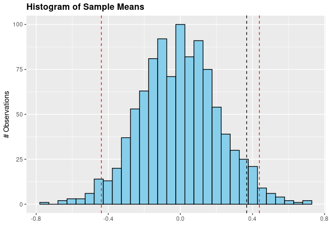
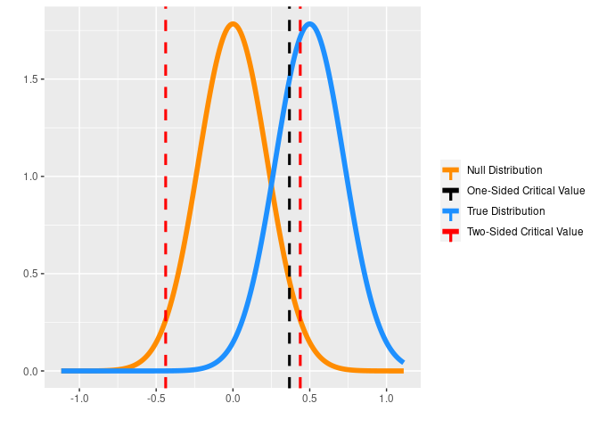
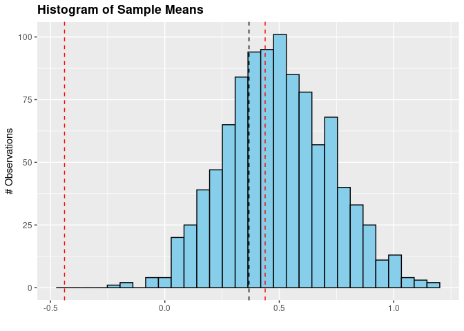
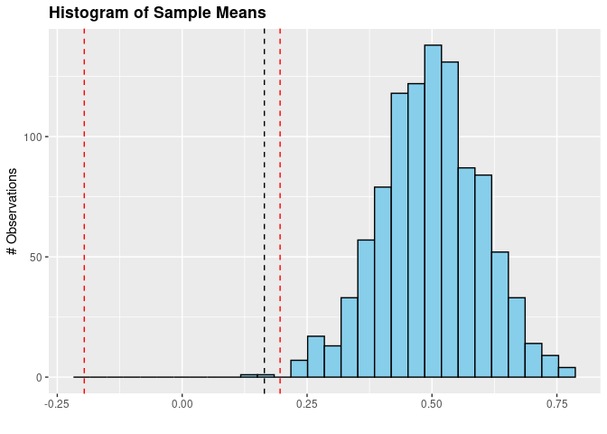
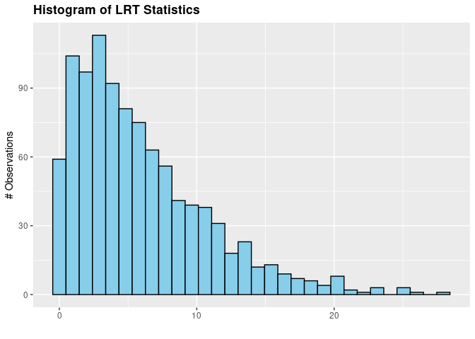
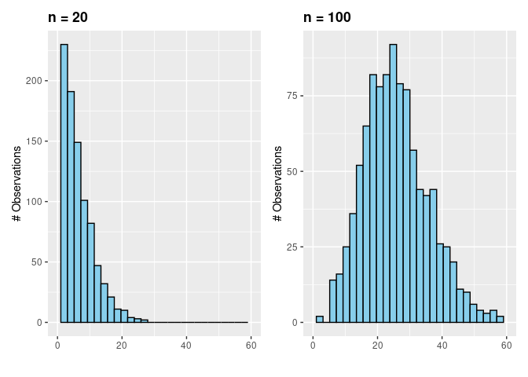

```r
library(dplyr)
library(magrittr)
library(ggplot2)
```

## **Problem 1**

### **1a.) Null Hypotheses**

**If you reject the null hypothesis, explain why this doesn't mean that your null hypothesis is definitely wrong. Also explain why if you cannot reject a null hypothesis, you cannot interpret this result that the null hypothesis is correct.**

If we reject the null hypothesis ($H_0$), this doesn't mean that $H_0$ is defintely incorrect, as in the steps we took to define our test on $H_0$, we have set a critical threshold of our test statistic in which we would reject the null hypothesis. The critical aspect to understand is that the critical threshold value was chosen to correspond **directly** to a probability of seeing a statistic of the value of more extreme **that we have directly injected into the system**. This non-zero probability thus impliest that **it is** possible that we have rejected $H_0$ due to calculating our statistic of interest on an extremely unlikely sample falling in our rejection region.

As well, if we cannot reject $H_0$, we cannot interpret this result that $H_0$ is completely correct, as there is a distinct non-zero probability that a statistic calculated from samples originating from an alternative distribution (any distribution other than precisely defined by $H_0$) fell within the range of expected values conditional on $H_0$.

### **1b) Controlling Type I Error and Power**

**Explain why we can precisely set the Type I error of a test but we cannot precisely control the power.**

Type I error is defined in forming critical aspects of the hypothesis test formed on $H_0$, as a critical value ($C_\alpha$) or values are chosen such that $H_0$ is rejected if a more extreme statistic is observed. These critical values are chosen to **directly and exactly** correspond to a believed probability ($\alpha$) of encountering the sample.

However, power (\$1 - \beta \$) is not a controllable aspect of a statistical hypothesis test. This is as power is a function of the **true distribution**, of which we are never aware of the exactly true parameters. This is definitional as well, as power can be defined as the probability that $H_0$ is correctly rejected given that it is incorrect. In order to calculate this probability, we would need to integrate the density of the true distribution ($\int_{x = C_\alpha}^{\infty} pdf_{H_T}(x)$ ), however we cannot compute this integral as $pdf_{H_T}(x)$ is unknown.

## **Problem 2**

**Consider a 'height' type experiment where we can assume** $X ∼ N(\mu,\sigma^2)$ where the true $\mu = 0.5$ and $\sigma^2 = 1$ is known to you in this case. Assume that you will be generating samples of size $n$ and that for each sample, the test statistic you will be calculating will be the mean of the sample. For parts [a, c, e, g] you are being asked to provide answers based on the distribution of the test statistic (the mean) for the null hypothesis or the true distribution for the experiment. For parts [b, d, f, h] you are being asked to simulate k = 1000 samples of size n (i.e., 1000 separate samples) under the null hypothesis or the true distribution for the experiment and for each of the k samples, you are asked to calculate the mean statistic. For parts [i, j], you are bring asked to calculate the LRT statistic for each of the 1000 samples of size n (i.e., a different statistic!) where each of the k samples is generated under the null hypothesis or the true distribution.

### **2a.) Critical Thresholds**

**Condsider** $H_0 : \mu = 0$ where you know the true $\sigma^2 = 1$ for the purposes of this question. Consider a sample $n = 20$ and the mean of the sample as the test statistic. What is the critical threshold for this statistic for a Type I error = $\alpha$ = 0.05 when considering $H_A > 0?$ What are the two values of the critical threshold for this statistic for a Type I error = $\alpha$ = 0.05 when condsidering $H_A \neq 0$?

**One-sided test**

We will first determine critical threshold for the specified statistic for $\alpha=0.05$ for $H_A : \mu > 0$.


```r
one_sided_crit_value <- 
  qnorm(p = 0.05, 
        mean = 0,
        # Corrected after update: 
        # The distribution of the statistic (mean)
        # will be normal with mean mu and sigma^2 = 1 / n
        sd = 1 / sqrt(20), 
        lower.tail = FALSE)

cat('C_{0.95} | H_0: mu = 0: ', one_sided_crit_value) 
```

```
C_{0.95} | H_0: mu = 0:  0.3678005
```

```r
mean <- 0
sd <- 1 / sqrt(20)
domain <- seq(from = mean - 5*sd, 
              to   = mean + 5*sd, 
              by   = .001)

df <- 
  dnorm(domain, 
        mean = mean, 
        sd = sd) %>% 
  data.frame(x = domain,
             y = .)


df %>%
  ggplot() + 
  geom_line(aes(x, y)) + 
  geom_vline(aes(xintercept = one_sided_crit_value), 
             col = 'red', 
             lty = 2) +
  annotate(geom = 'text', 
           x = one_sided_crit_value + (.35*one_sided_crit_value), 
           y = .7 * max(df$y), 
           label = 'C_0.95', 
           angle = -45, 
           color = 'red') + 
  xlab('') + ylab('Density')
```

<!-- -->

**Two-sided test**

We now determine critical threshold for the specified statistic for $\alpha=0.05$ for $H_A : \mu \neq 0$.


```r
lower_crit_value <- 
  qnorm(p = 0.05 / 2, 
        mean = 0,
        sd = 1 / sqrt(20))

upper_crit_value <- 
  qnorm(p = 0.05 / 2, 
        mean = 0,
        sd = 1 / sqrt(20), 
        lower.tail = FALSE)

cat('C_{0.025} | H_0: mu = 0: ', lower_crit_value) 
```

```
C_{0.025} | H_0: mu = 0:  -0.4382613
```

```r
cat('C_{0.975} | H_0: mu = 0: ', upper_crit_value) 
```

```
C_{0.975} | H_0: mu = 0:  0.4382613
```

```r
mean <- 0
sd <- 1 / sqrt(20)
domain <- seq(from = mean - 5*sd, 
              to   = mean + 5*sd, 
              by   = .01)
df <- 
  dnorm(domain, 
        mean = mean, 
        sd = sd) %>% 
  data.frame(x = domain,
             y = .)

df %>%
  ggplot() + 
  geom_line(aes(x, y))+
  geom_vline(aes(xintercept = lower_crit_value), 
             col = 'red', 
             lty = 2) + 
  geom_vline(aes(xintercept = upper_crit_value), 
             col = 'red', 
             lty = 2) + 
  annotate(geom = 'text', 
           x = lower_crit_value + (.35*lower_crit_value), 
           y = .7 * max(df$y), 
           label = 'C_0.025', 
           angle = -45, 
           color = 'red') + 
    annotate(geom = 'text', 
           x = upper_crit_value + (.35*upper_crit_value), 
           y = .7 * max(df$y), 
           label = 'C_0.975', 
           angle = -45, 
           color = 'red') + 
  xlab('') + ylab('Density')
```

<!-- -->

### **2b.) Histogram of Means under the Null Distribution**

**Simulate k = 1000 samples under the null hypothesis from part [a], calculate the mean for each sample, and plot a histogram of the means. How many samples statistics are beyond the critical thresholds you calculated in part [a]?**


```r
test_stats <- 
  sapply(1:1000, 
         function(x) {
          rnorm(20, 
                mean = 0, 
                sd = 1) %>% 
             mean()
         })


p1_2b <- 
  test_stats %>% 
  data.frame(x = .) %>% 
  ggplot() + 
  geom_histogram(aes(x), 
                 color = 'black', 
                 fill = 'skyblue') + 
  geom_vline(aes(xintercept = one_sided_crit_value), 
             col = 'black', lty = 2) +
  geom_vline(aes(xintercept = upper_crit_value), 
             col = 'red', lty = 2) +
  geom_vline(aes(xintercept = lower_crit_value), 
             col = 'red', lty = 2) + 
  xlab('') + ylab('# Observations') + 
  ggtitle('Histogram of Sample Means') + 
  theme(plot.title = element_text(face = 'bold'))

print(p1_2b)
```

<!-- -->

```r
how_many <- function(x) length(which(x))

how_many(test_stats > one_sided_crit_value)
```

```
[1] 52
```

```r
how_many(test_stats < lower_crit_value)
```

```
[1] 27
```

```r
how_many(test_stats > upper_crit_value)
```

```
[1] 18
```

### **2c.) Calculating Power Given Known True Distriubtion**

**Consider the true distribution of the experiment $\mu = 0.5$, $sigma^2 = 1$ for the purposes of this question. Consider a sample size $n = 20$ and the mean of the sample as the test statistic. What is the power of this test for the null hypothesis in part [a] with a Type I error = $\alpha$ = 0.05 when considering $H_A > 0$? When is the power of this test for the null hypothesis in part [a] with a Type I error = $\alpha$ = $0.05$ when considering $H_A \neq 0$?**


```r
# power = prob of correctly rejecting the null given that it is false
#       = area under the TRUE distribution outside the critical values on the
#          NULL distribution

one_tail_power <- 
  pnorm(one_sided_crit_value, 
        mean = 0.5, 
        sd = 1 / sqrt(20), 
        lower.tail = FALSE)


two_tail_power <- 
  pnorm(lower_crit_value, 
        mean = 0.5, 
        sd = 1 / sqrt(20)) +
  pnorm(upper_crit_value, 
        mean = 0.5, 
        sd = 1 / sqrt(20), 
        lower.tail = FALSE) 

cat('One tailed power: ', one_tail_power, '\n')
```

```
One tailed power:  0.7228116 
```

```r
cat('Two tailed power: ', two_tail_power, '\n')
```

```
Two tailed power:  0.6087795 
```


```r
mean <- 0
sd <- 1 / sqrt(20)
domain <- seq(from = mean - 5*sd, 
              to   = mean + 5*sd, 
              by   = .01)
df <-
  data.frame(
    domain = domain,
    null = dnorm(domain, 
                 mean = 0, 
                 sd = 1 / sqrt(20)), 
    true = dnorm(domain, 
                 mean = 0.5, 
                 sd = 1 / sqrt(20))) %>% 
  tidyr::pivot_longer(-c('domain')) 

colors <- 
  c('One-Sided Critical Value' = 'black', 
    'Two-Sided Critical Value' = 'red', 
    'true' = 'dodgerblue', 
    'null' = 'darkorange')
  

df %>%
  ggplot() + 
  geom_line(aes(domain, value, col = name), size = 2) + 
  geom_vline(aes(xintercept = lower_crit_value, 
                 color = 'Two-Sided Critical Value'), 
              lty = 2, lwd = 1.1) + 
  geom_vline(aes(xintercept = upper_crit_value, 
                color = 'Two-Sided Critical Value'), 
             lty = 2, lwd = 1.1) + 
  geom_vline(aes(xintercept = one_sided_crit_value, 
                 color = 'One-Sided Critical Value'), 
             lty = 2, lwd = 1.1) + 
  scale_color_manual(values = colors, 
                     labels = c('Null Distribution', 
                                'One-Sided Critical Value', 
                                'True Distribution', 
                                'Two-Sided Critical Value')) + 
  theme(legend.title = element_blank()) + 
  xlab('') + ylab('') 
```

<!-- -->

### **2d.) Histogram of Means under the True Distribution**

**Simulate k = 1000 samples under the true distribution, calculate the mean for each sample, and plot a histogram of the means.**


```r
set.seed(497)

test_stats <- 
  sapply(1:1000, 
         function(x) {
          rnorm(20, 
                mean = 0.5, 
                sd = 1) %>% 
             mean()
         })


p2_2d <-
  test_stats %>% 
  data.frame(x = .) %>% 
  ggplot() + 
  geom_histogram(aes(x), 
                 color = 'black', 
                 fill = 'skyblue') + 
  geom_vline(aes(xintercept = one_sided_crit_value), 
             col = 'black', lty = 2) +
  geom_vline(aes(xintercept = upper_crit_value), 
             col = 'red', lty = 2) +
  geom_vline(aes(xintercept = lower_crit_value), 
             col = 'red', lty = 2) + 
  xlab('') + ylab('# Observations') + 
  ggtitle('Histogram of Sample Means') + 
  theme(plot.title = element_text(face = 'bold'))

print(p2_2d)
```

<!-- -->

```r
how_many <- function(x) length(which(x))

how_many(test_stats > one_sided_crit_value)
```

```
[1] 702
```

```r
how_many(test_stats < lower_crit_value)
```

```
[1] 0
```

```r
how_many(test_stats > upper_crit_value)
```

```
[1] 579
```


```r
library(patchwork)

min_x <- min(p1_2b$data, p2_2d$data)
max_x <- max(p1_2b$data, p2_2d$data)

p1_2b <- p1_2b + ggtitle('Null Distribution Generated Samples') + xlim(min_x, max_x)
p2_2d <- p2_2d + ggtitle('True Distribution Generated Samples') + xlim(min_x, max_x)

p1_2b + p2_2d
```

<!-- -->

### **2e.) Repeat [a] with n = 100**

**One-sided test**

We will first determine critical threshold for the specified statistic for $\alpha=0.05$ for $H_A : \mu > 0$.


```r
one_sided_crit_value <- 
  qnorm(p = 0.05, 
        mean = 0,
        # Corrected after update: 
        # The distribution of the statistic (mean)
        # will be normal with mean mu and sigma^2 = 1 / n
        sd = 1 / sqrt(100), 
        lower.tail = FALSE)

cat('C_{0.95} | H_0: mu = 0: ', one_sided_crit_value) 
```

```
C_{0.95} | H_0: mu = 0:  0.1644854
```

```r
mean <- 0
sd <- 1 / sqrt(100)
domain <- seq(from = mean - 5*sd, 
              to   = mean + 5*sd, 
              by   = .001)

df <- 
  dnorm(domain, 
        mean = mean, 
        sd = sd) %>% 
  data.frame(x = domain,
             y = .)


df %>%
  ggplot() + 
  geom_line(aes(x, y)) + 
  geom_vline(aes(xintercept = one_sided_crit_value), 
             col = 'red', 
             lty = 2) +
  annotate(geom = 'text', 
           x = one_sided_crit_value + (.35*one_sided_crit_value), 
           y = .7 * max(df$y), 
           label = 'C_0.95', 
           angle = -45, 
           color = 'red') + 
  xlab('') + ylab('Density')
```

<!-- -->

**Two-sided test**

We now determine critical threshold for the specified statistic for $\alpha=0.05$ for $H_A : \mu \neq 0$.


```r
lower_crit_value <- 
  qnorm(p = 0.05 / 2, 
        mean = 0,
        sd = 1 / sqrt(100))

upper_crit_value <- 
  qnorm(p = 0.05 / 2, 
        mean = 0,
        sd = 1 / sqrt(100), 
        lower.tail = FALSE)

cat('C_{0.025} | H_0: mu = 0: ', lower_crit_value) 
```

```
C_{0.025} | H_0: mu = 0:  -0.1959964
```

```r
cat('C_{0.975} | H_0: mu = 0: ', upper_crit_value) 
```

```
C_{0.975} | H_0: mu = 0:  0.1959964
```

```r
mean <- 0
sd <- 1 / sqrt(100)
domain <- seq(from = mean - 5*sd, 
              to   = mean + 5*sd, 
              by   = .01)
df <- 
  dnorm(domain, 
        mean = mean, 
        sd = sd) %>% 
  data.frame(x = domain,
             y = .)

breaks <-
  quantile(df$x) %>%
  c(lower_crit_value, 
    upper_crit_value) %>% 
  unname() %>% round(1)

labels <- breaks
labels[length(labels) - 1] <- 'C_low'
labels[length(labels)] <- 'C_high'

df %>%
  ggplot() + 
  geom_line(aes(x, y))+
  geom_vline(aes(xintercept = lower_crit_value), 
             col = 'red', 
             lty = 2) + 
  geom_vline(aes(xintercept = upper_crit_value), 
             col = 'red', 
             lty = 2) + 
  # scale_x_continuous(breaks = breaks,
  #                    labels = labels) + 
  annotate(geom = 'text', 
           x = lower_crit_value + (.35*lower_crit_value), 
           y = .7 * max(df$y), 
           label = 'C_0.025', 
           angle = -45, 
           color = 'red') + 
    annotate(geom = 'text', 
           x = upper_crit_value + (.35*upper_crit_value), 
           y = .7 * max(df$y), 
           label = 'C_0.975', 
           angle = -45, 
           color = 'red') + 
  xlab('') + ylab('Density')
```

<!-- -->


### **2f.) Repeat [b], but with n = 100**

**Simulate k = 1000 samples under the null hypothesis from part [a], calculate the mean for each sample, and plot a histogram of the means. How many samples statistics are beyond the critical thresholds you calculated in part [a]?**


```r
set.seed(497)

test_stats <- 
  sapply(1:1000, 
         function(x) {
          rnorm(100, 
                mean = 0, 
                sd = 1) %>% 
             mean()
         })


p1_2f <- 
  test_stats %>% 
  data.frame(x = .) %>% 
  ggplot() + 
  geom_histogram(aes(x), 
                 color = 'black', 
                 fill = 'skyblue') + 
  geom_vline(aes(xintercept = one_sided_crit_value), 
             col = 'black', lty = 2) +
  geom_vline(aes(xintercept = upper_crit_value), 
             col = 'red', lty = 2) +
  geom_vline(aes(xintercept = lower_crit_value), 
             col = 'red', lty = 2) + 
  xlab('') + ylab('# Observations') + 
  ggtitle('Histogram of Sample Means') + 
  theme(plot.title = element_text(face = 'bold'))


print(p1_2f)
```

<!-- -->

```r
how_many <- function(x) length(which(x))

how_many(test_stats > one_sided_crit_value)
```

```
[1] 45
```

```r
how_many(test_stats < lower_crit_value)
```

```
[1] 32
```

```r
how_many(test_stats > upper_crit_value)
```

```
[1] 21
```

### **2g.) Repeat [c], but with n = 100**


```r
# power = prob of correctly rejecting the null given that it is false
#       = area under the TRUE distribution outside the critical values on the
#          NULL distribution

one_tail_power <- 
  pnorm(one_sided_crit_value, 
        mean = 0.5, 
        sd = 1 / sqrt(100), 
        lower.tail = FALSE)


two_tail_power <- 
  pnorm(lower_crit_value, 
        mean = 0.5, 
        sd = 1 / sqrt(100)) +
  pnorm(upper_crit_value, 
        mean = 0.5, 
        sd = 1 / sqrt(100), 
        lower.tail = FALSE) 

cat('One tailed power: ', one_tail_power, '\n')
```

```
One tailed power:  0.9996034 
```

```r
cat('Two tailed power: ', two_tail_power, '\n')
```

```
Two tailed power:  0.9988173 
```


```r
mean <- 0
sd <- 1 / sqrt(100)
domain <- seq(from = mean - 5*sd, 
              to   = mean + 5*sd, 
              by   = .001)
df <-
  data.frame(
    domain = domain,
    null = dnorm(domain, 
                 mean = 0, 
                 sd = 1 / sqrt(100)), 
    true = dnorm(domain, 
                 mean = 0.5, 
                 sd = 1 / sqrt(100))) %>% 
  tidyr::pivot_longer(-c('domain')) 

colors <- 
  c('One-Sided Critical Value' = 'black', 
    'Two-Sided Critical Value' = 'red', 
    'true' = 'dodgerblue', 
    'null' = 'darkorange')
  

df %>%
  ggplot() + 
  geom_line(aes(domain, value, col = name), size = 2) + 
  geom_vline(aes(xintercept = lower_crit_value, 
                 color = 'Two-Sided Critical Value'), 
              lty = 2, lwd = 1.1) + 
  geom_vline(aes(xintercept = upper_crit_value, 
                color = 'Two-Sided Critical Value'), 
             lty = 2, lwd = 1.1) + 
  geom_vline(aes(xintercept = one_sided_crit_value, 
                 color = 'One-Sided Critical Value'), 
             lty = 2, lwd = 1.1) + 
  scale_color_manual(values = colors, 
                     labels = c('Null Distribution', 
                                'One-Sided Critical Value', 
                                'True Distribution', 
                                'Two-Sided Critical Value')) + 
  theme(legend.title = element_blank()) + 
  xlab('') + ylab('') 
```

<!-- -->

### **2h.) Repeat [d], but with n = 100**


```r
set.seed(497)

test_stats <- 
  sapply(1:1000, 
         function(x) {
          rnorm(100, 
                mean = 0.5, 
                sd = 1) %>% 
             mean()
         })


p2_2h <- 
  test_stats %>% 
  data.frame(x = .) %>% 
  ggplot() + 
  geom_histogram(aes(x), 
                 color = 'black', 
                 fill = 'skyblue') +
  geom_vline(aes(xintercept = one_sided_crit_value), 
             col = 'black', lty = 2) +
  geom_vline(aes(xintercept = upper_crit_value), 
             col = 'red', lty = 2) +
  geom_vline(aes(xintercept = lower_crit_value), 
             col = 'red', lty = 2) + 
  xlab('') + ylab('# Observations') + 
  ggtitle('Histogram of Sample Means') + 
  theme(plot.title = element_text(face = 'bold'))


print(p2_2h)
```

<!-- -->

```r
how_many <- function(x) length(which(x))

how_many(test_stats > one_sided_crit_value)
```

```
[1] 998
```

```r
how_many(test_stats < lower_crit_value)
```

```
[1] 0
```

```r
how_many(test_stats > upper_crit_value)
```

```
[1] 998
```


```r
library(patchwork)

min_x <- min(p1_2f$data, p2_2h$data)
max_x <- max(p1_2f$data, p2_2h$data)

p1_2f <- p1_2f + ggtitle('Null Distribution Generated Samples') + xlim(c(min_x, max_x))
p2_2h <- p2_2h + ggtitle('True Distribution Generated Samples') + xlim(c(min_x, max_x))

p1_2f + p2_2h
```

<!-- -->

### **2i.) Likelihood Ratio Test Under the Null**

**For the samples you generated in parts [b] and [f] calculate the** $LRT = -2ln \frac{L(\hat{\mu}_0 | \mathbf{x})}{L(\hat{\mu}_1 | \mathbf{x})}$ statistic for $\hat{\mu}_1 \in (-\infty, \infty)$ and plot a histogram of these statistics.

**n = 20**


```r
set.seed(497)

samples <- 
  lapply(1:1000, 
         function(x) {
            rnorm(20, 
                mean = 0, 
                sd = 1)
         })


lrt_stats <- vector('numeric', length(samples))

for (i in seq_along(samples)) {
  
  sample <- samples[[i]]
  
  null_likelihood <-
    dnorm(sample, 
          mean = 0, 
          sd = 1) %>% 
    log() %>% 
    sum() %>% 
    exp()
  
  # MLE of mu is the mean of the sample
  #     and sigma is said to be known in 
  #     this instance, so it would be best 
  #     to use this known value.
  mle_likelihood <- 
    dnorm(sample, 
      mean = mean(sample), 
      sd = 1) %>% 
    log() %>% 
    sum() %>% 
    exp()
  
  
  lrt_stats[[i]] <- -2 * log(null_likelihood / mle_likelihood)
}


p1_2i <- 
  lrt_stats %>% 
  data.frame(stats = .) %>% 
  ggplot() + 
    geom_histogram(aes(stats), 
                   color = 'black', 
                   fill = 'skyblue') + 
    xlab('') + ylab('# Observations') + 
    ggtitle('Histogram of LRT Statistics') + 
    theme(plot.title = element_text(face = 'bold'))


p1_2i
```

<!-- -->

**n = 100**


```r
set.seed(497)

samples <- 
  lapply(1:1000, 
         function(x) {
            rnorm(100, 
                mean = 0, 
                sd = 1)
         })


lrt_stats <- vector('numeric', length(samples))

for (i in seq_along(samples)) {
  
  sample <- samples[[i]]
  
  null_likelihood <-
    dnorm(sample, 
          mean = 0, 
          sd = 1) %>% 
    log() %>% 
    sum() %>% 
    exp()
  
  
  mle_likelihood <- 
    dnorm(sample, 
      mean = mean(sample), 
      sd = 1) %>% 
    log() %>% 
    sum() %>% 
    exp()
  
  
  lrt_stats[[i]] <- -2 * log(null_likelihood / mle_likelihood)
}


p2_2i <-
  lrt_stats %>%
  data.frame(stats = .) %>%
  ggplot() + 
  geom_histogram(aes(stats), 
                 color = 'black', 
                 fill = 'skyblue') + 
  xlab('') + ylab('# Observations') + 
  ggtitle('Histogram of LRT Statistics') + 
  theme(plot.title = element_text(face = 'bold'))


p2_2i
```

<!-- -->


```r
p1_2i <- p1_2i + ggtitle('n = 20') 
p2_2i <- p2_2i + ggtitle('n = 100')

p1_2i + p2_2i
```

<!-- -->

### **2j.) Likelihood Ratio Test Under the True Distribution**

**For the samples you generated in parts [d] and [h] calculate the** $LRT = -2ln \frac{L(\hat{\mu}_0 | \mathbf{x})}{L(\hat{\mu}_1 | \mathbf{x})}$ statistic for $\hat{\mu}_1 \in (-\infty, \infty)$ and plot a histogram of these statistics.

**n = 20**


```r
set.seed(497)

samples <- 
  lapply(1:1000, 
         function(x) {
            rnorm(20, 
                mean = 0.5, 
                sd = 1)
         })


lrt_stats <- vector('numeric', length(samples))

for (i in seq_along(samples)) {
  
  sample <- samples[[i]]
  
  null_likelihood <-
    dnorm(sample, 
          mean = 0, 
          sd = 1) %>% 
    log() %>% 
    sum() %>% 
    exp()
  
  # MLE of mu is the mean of the sample
  #     and sigma is said to be known in 
  #     this instance, so it would be best 
  #     to use this known value.
  mle_likelihood <- 
    dnorm(sample, 
      mean = mean(sample), 
      sd = 1) %>% 
    log() %>% 
    sum() %>% 
    exp()
  
  
  lrt_stats[[i]] <- -2 * log(null_likelihood / mle_likelihood)
}


p1_2j <- 
  lrt_stats %>% 
  data.frame(stats = .) %>% 
  ggplot() + 
  geom_histogram(aes(stats), 
                 color = 'black', 
                 fill = 'skyblue') + 
  xlab('') + ylab('# Observations') + 
  ggtitle('Histogram of LRT Statistics') + 
  theme(plot.title = element_text(face = 'bold'))

p1_2j
```

<!-- -->

**n = 100**


```r
set.seed(497)

samples <- 
  lapply(1:1000, 
         function(x) {
            rnorm(100, 
                mean = 0.5, 
                sd = 1)
         })


lrt_stats <- vector('numeric', length(samples))

for (i in seq_along(samples)) {
  
  sample <- samples[[i]]
  
  null_likelihood <-
    dnorm(sample, 
          mean = 0, 
          sd = 1) %>% 
    log() %>% 
    sum() %>% 
    exp()
  
  
  mle_likelihood <- 
    dnorm(sample, 
      mean = mean(sample), 
      sd = 1) %>% 
    log() %>% 
    sum() %>% 
    exp()
  
  
  lrt_stats[[i]] <- -2 * log(null_likelihood / mle_likelihood)
}


p2_2j <-
  lrt_stats %>%
  data.frame(stats = .) %>%
  ggplot() + 
  geom_histogram(aes(stats), 
                 color = 'black', 
                 fill = 'skyblue') + 
  xlab('') + ylab('# Observations') + 
  ggtitle('Histogram of LRT Statistics') + 
  theme(plot.title = element_text(face = 'bold'))

p2_2j
```

<!-- -->


```r
min_x <- min(p1_2j$data, p2_2j$data)
max_x <- max(p1_2j$data, p2_2j$data)

p1_2j <- p1_2j + ggtitle('n = 20') + xlim(c(min_x, max_x))
p2_2j <- p2_2j + ggtitle('n = 100') + xlim(c(min_x, max_x)) 

p1_2j + p2_2j
```

<!-- -->

## **3.) Prove** $Pr(pval(T(X))) \sim unif[0,1] |$ H_0 is true

By the [Probability integral transform](https://en.wikipedia.org/wiki/Probability_integral_transform), we can show

$$
T(X) \sim F(T(X))
$$

```{=tex}
\begin{align*}
& pval = F(T(X) \geq t) \\ 
& = 1 - CDF(F(T(X)))
\end{align*}
```
Let $p \in (0,1)$

Then,

```{=tex}
\begin{align*}

& Pr(pval \leq p)  \\ 
& = Pr(F_{T(X)}(T(X)) \leq p) \\ 
& = Pr(F^{-1}_{T(X)}(F_{T(X)}(T(X))) \leq F^{-1}_{T(X)}(p)) \\ 
& = Pr(T(X) \leq F^{-1}_{T(X)}(p)) \\
& = 1 - F_{T(X)}(F^{-1}_{T(X)}(p)) \\
& = 1 - p 

\end{align*}
```
Which can only be the case if the distribution of p-values is uniform.

**Visual Aid of Proof**

The only way that the expression $Pr(pval \leq p) = p$ can hold $\forall p$, is if the distribution of p-values is uniform.


```r
plot(NULL, NULL, 
     xlim = c(0, 1), 
     ylim = c(0,0.2), 
     xlab = 'pval', 
     ylab = 'Density', 
     yaxt = 'n')

abline(h = 0.05, lwd = 4, lty = 2)

rect(xleft = 0.2, 
     xright = 0.205, 
     ybottom = -1,
     ytop = 0.05, 
     density = 100)

rect(xleft = 0, 
     xright = 0.2, 
     ybottom = -1,
     ytop = 0.05, 
     density = 3)

text(x = 0.2, 
     y = 0.06, 
     'p = 0.2', 
     font = 2)

text(x = 0.2, 
     y = 0.1, 
     'Pr(pval < p) = Area = p', 
     font = 2, 
     cex = 1.4)


arrows(x0 = 0.1, 
       x1 = 0.1, 
       y0 = 0.09, 
       y1 = 0.03, 
       lwd = 4)
```

<!-- -->
